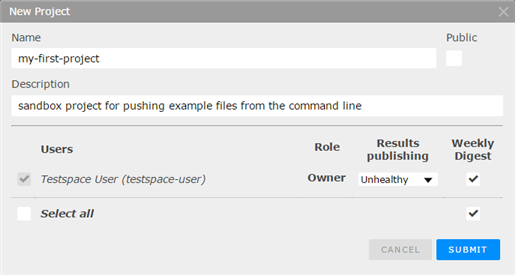

[](http://www.testspace.com)

## Getting Started with Testspace Standalone Projects.

The first step when getting started is to create your Testspace Organization. When you sign into Testspace to create your account, select and `Organization Name` to be used as the subdomain for your Testspace URL.

```
   my-organization-name.testspace.com
```

### Creating your first Standalone Project and Space

After completing the new account process -- and every time you login thereafter -- you'll land on the Projects tab, the home view for your Testspace Organization.

On first time access, your Projects page will display the following.


Select the `New Project` button to bring up the dialog below.



Provide a Project name and optional description - notification settings can be changed at anytime. 

Select `SUBMIT`, and then select the name-link for your new project to go to the `Spaces tab` which should look as follows.


Select the `New Space` button to bring up the dialog below.


Provide a Space name and optional description and `SUBMIT`.

You're now ready to download the Testspace client to start pushing data

---
### Installing the Testspace Client

A simple command line client is used to push test results and other metrics to the Testpace server.

If installing on linux, you can use the following command (if $HOME/bin exists)
```
  curl -s https://testspace-client.s3.amazonaws.com/testspace-linux.tgz | tar -zxvf- -C $HOME/bin

```

If installing on Windows, there a serveral methods, depending on your tools available. Using `curl` or `wget`

```
  curl -o testspace-windows.zip https://testspace-client.s3.amazonaws.com/testspace-windows.zip
```
```
  wget --no-check-certificate -N https://testspace-client.s3.amazonaws.com/testspace-windows.zip
  
```
or from a Power Shell console
```
  Invoke-WebRequest https://testspace-client.s3.amazonaws.com/testspace-windows.zip -outfile testspace-windows.zip
```

### Configuring your Testspace URL
The command to push test results to the server using the Testpace Client takes the following forms.  If pushing to `Private Testpace Project`, you will need to provide your access token for credentials to access the Project.
```
  testspace results.xml access-token@orgnization-name.testspace.com/project-name/space-name"
```
If pushing results to a `Public Testspace Project` access credentials are not required.
```
  testspace results.xml orgnization-name.testspace.com/project-name/space-name"
```
To simplify the command line for interactive use, you can set the default URL using the Testspace Clients' `config` command. For example you can set a partial default URL and then specify the Space name when pushing files.
```
  testspace config url organization-name.testspace.com/project-name
```
The command to push the same restuls.xml file after configuring the URL as above.
```
  tetsspace results.xml space-name
```

### Pushing Sample Data from this Repository


## Publishing sample for demonstrating Testspace 

Contains a set of simple files to show publishing test results, code coverage, and static analysis. 

***

Publishing **Test Content** using www.testspace.com.

[](https://samples.testspace.com/spaces/833 "Test Cases")
[](https://samples.testspace.com/spaces/833/schema/Code%20Coverage "Code Coverage (lines)")
[](https://samples.testspace.com/spaces/833/schema/Static%20Analysis "Static Analysis (issues)")


***

Push Content using **Testspace client**: 

<pre>
curl -s https://testspace-client.s3.amazonaws.com/testspace-linux.tgz | sudo tar -zxvf- -C /usr/local/bin
testspace @.testspace.txt $TESTSPACE_TOKEN/$GITHUB_ORG:$REPO_NAME/$BRANCH_NAME#$BUILD_NUMBER
</pre> 

Checkout the published [Test Content](https://samples.testspace.com/projects/testspace-samples:getting.started). Note that the `.testspace.txt` file contains the [set of files](http://help.testspace.com/how-to:publish-content#publishing-via-content-list-file) to publish. 

***

To replicate this sample: 
  - Setup account at www.testspace.com.
  - Create a Environment variable called `TESTSPACE_TOKEN`
     - `TESTSPACE_TOKEN` = `credentials@Your-Org-Name.testspace.com`
     - `credentials` set to `username:password` or your [access token](http://help.testspace.com/reference:client-reference#login-credentials)
     - To [use Testspace with a CI system](http://help.testspace.com/how-to:add-to-ci-workflow), store `TESTSPACE_TOKEN` as a secure environment variable
 
